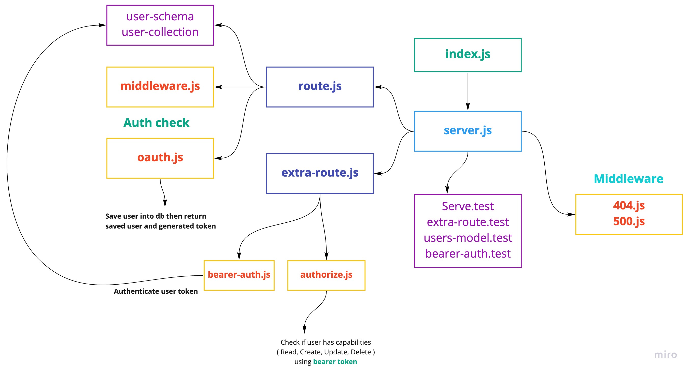

# auth-server

**Author**: _Waleed A. Afifi_

Authentication Server **Phase 4**: Role Based Access Control

Being able to login is great. But controlling access at a more granular level is vital to creating a scalable system. In this lab, you will implement Role Based Access Control (**RBAC**) using an Access Control List (**ACL**), allowing to not only restrict access to routes for valid users, but also based on the individual permissions we give each user.

#### Routs
- [POST] http://localhost:3000/signup
- [POST] http://localhost:3000/signin
- [GET] http://localhost:3000/users
- [GET] http://localhost:3000/
- [GET] http://localhost:3000/secret
   - must send Bearer token to authenticate the user if its allows to see the content or not
- [GET] http://localhost:3000/private
   - must send Bearer token to authenticate the user if its allows to see the content or not
- [POST] http://localhost:3000/create
   - must send Bearer token to authenticate the user if its allows to see the content or not and must has the create capabilities
- [DELETE] http://localhost:3000/delete
   - must send Bearer token to authenticate the user if its allows to see the content or not and must has the delete capabilities
- [PUT] http://localhost:3000/update
   - must send Bearer token to authenticate the user if its allows to see the content or not and must has the update capabilities
- [GET] http://localhost:3000/readonly
   - must send Bearer token to authenticate the user if its allows to see the content or not and must has the read capabilities

#### `.env` 
- PORT=3000
- MONGO_URL=mongodb://localhost:27017/auth
- SECRET=WaleedAfifi
- GITHUB_CLIENT_ID=
- GITHUB_CLIENT_SECRET=

### Modules
- server.js
- users
   - user-schema.js
   - usre-collction.js
- middleware
   - 404.js
   - 500.js
   - middlewware
   - oauth.js
   - bearer-auth.js
   - authorize.js
- routes
   - route.js
   - extra-routes.js
- __test__
   - bearer-auth.test.js
   - extra-routes.test.js
   - server.test.js
   - users-model.test.js

### Packages
- @code-fellows/supergoose
- cors
- dotenv
- eslint
- express
- jest
- mongoose
- morgan
- base-64
- bcrypt
- jsonwebtoken

#### How to initialize/run your application (where applicable)

- `node index.js`
- `npm run dev` -> nodemon

<!-- #### How to use your library (where applicable)
- Lint Tests: `npm run lint` -->

#### Tests

* How do you run tests?
- Jest test: `npm test` 

#### UML
