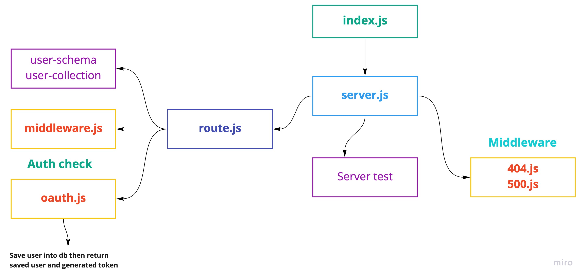

# auth-server

**Author**: _Waleed A. Afifi_

Authentication System **Phase 1**: Deploy an Express server that implements Basic Authentication, with signup and signin capabilities, using a Mongo database for storage.

#### Routs
- [POST] http://localhost:3000/signup
- [POST] http://localhost:3000/signin
- [GET] http://localhost:3000/users
- [GET] http://localhost:3000/

#### `.env` 
- PORT=3000
- MONGO_URL=mongodb://localhost:27017/auth
- SECRET=WaleedAfifi
- GITHUB_CLIENT_ID=
- GITHUB_CLIENT_SECRET=

### Modules
- server.js
- users
   - user-schema.js
   - usre-collction.js
- middleware
   - 404.js
   - 500.js
   - middlewware
   - oauth.js
- route.js

### Packages
- @code-fellows/supergoose
- cors
- dotenv
- eslint
- express
- jest
- mongoose
- morgan
- base-64
- bcrypt
- jsonwebtoken

#### How to initialize/run your application (where applicable)

- `node index.js`
- `npm run dev` -> nodemon

<!-- #### How to use your library (where applicable)
- Lint Tests: `npm run lint` -->

#### Tests

* How do you run tests?
- Jest test: `npm test` 

#### UML
